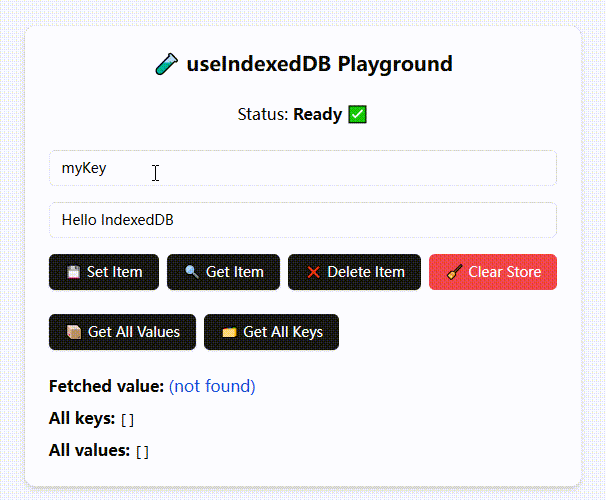
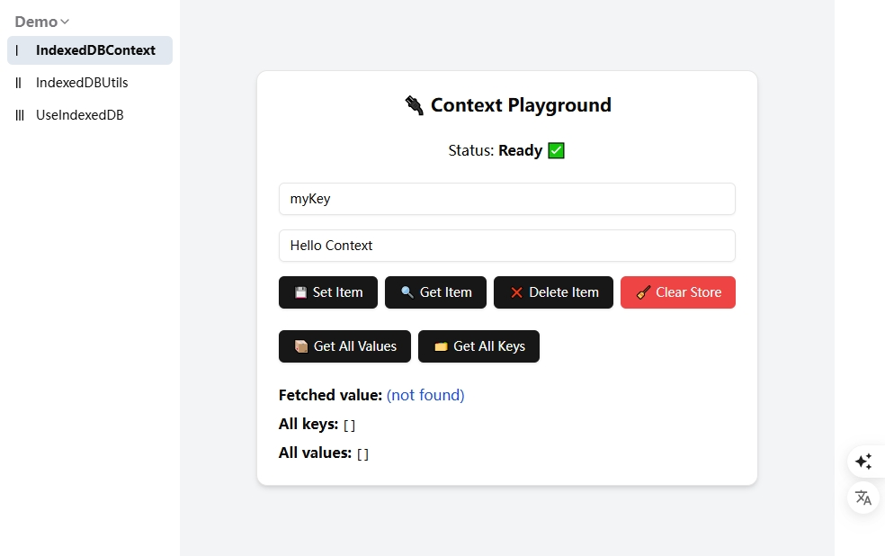
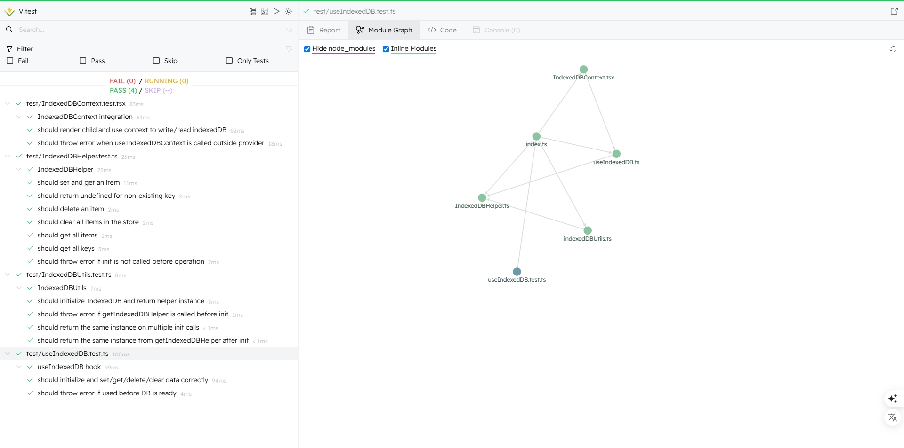
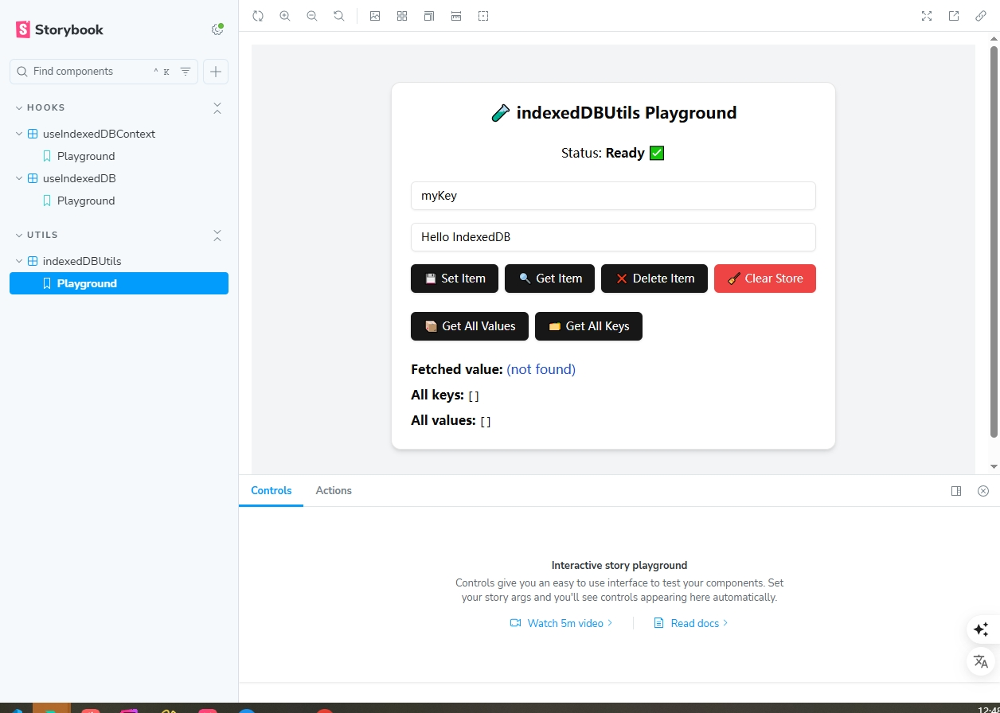

# 🚀 react-idb-toolkit

[English](./README.md) | [简体中文](./README.CN.md)


> ⚛️ 一个优雅且易于使用的 React 工具包，用于通过 IndexedDB 管理本地结构化数据，基于 [idb](https://github.com/jakearchibald/idb) 构建。  
> 一个简单、轻量、易用的 React Hook，用于在浏览器中通过 IndexedDB 存储结构化数据。支持多 store 初始化，支持常见的 `get/set/delete/clear` 操作，并有良好的 TypeScript 类型支持与测试用例。

  
  
  


[访问示例](https://aiyoudiao.github.io/react-idb-toolkit/index.html)

<p align="center">
    
    
</p>

---


## 📦 安装

```bash
npm install react-idb-toolkit
# 或
yarn add react-idb-toolkit
```

---

## ✨ 特性

* ✅ 使用 [`idb`](https://www.npmjs.com/package/idb) 封装 IndexedDB，API 简洁直观
* 🔁 支持自动创建多个 object store
* 🧪 内置单元测试（使用 Vitest）
* 📖 提供交互式 Storybook 示例
* 🧠 基于 React Hooks，支持类型推导与泛型
* 📦 除 `idb` 外无其他依赖

---

## 🛠️ 使用示例

```tsx
import { useIndexedDB } from 'react-idb-toolkit';

const { loading, setItem, getItem, deleteItem, clear, getAll, keys } = useIndexedDB({
  dbName: 'myDatabase',
  storeNames: ['myStore'],
});

useEffect(() => {
  if (!loading) {
    setItem('myStore', 'userName', 'demo');
  }
}, [loading]);
```

### ⚙️ Hook 参数

```ts
interface UseIndexedDBOptions {
  dbName: string;       // 数据库名称
  version?: number;     // 数据库版本，默认为 1
  storeNames: string[]; // 要创建的 object store 名称数组
}
```

### 📦 Hook 返回值

```ts
interface UseIndexedDBReturn {
  loading: boolean; // 是否仍在初始化过程中
  getItem<T>(store, key): Promise<T | undefined>;
  setItem<T>(store, key, value): Promise<void>;
  deleteItem(store, key): Promise<void>;
  clear(store): Promise<void>;
  getAll<T>(store): Promise<T[]>;
  keys(store): Promise<IDBValidKey[]>;
}
```

---

## 🧪 测试

本项目使用 [Vitest](https://vitest.dev) 进行单元测试，并借助 `fake-indexeddb` 模拟 IndexedDB 环境。

运行测试：

```bash
npm test
```

测试内容包括：

* 数据的存储、读取、删除与清空
* 获取所有 key 和所有 value
* 未初始化数据库时的异常处理

---

## 📖 Storybook Playground

运行以下命令启动交互式 Playground：

```bash
npm run storybook
```

你可以在 Playground 中：

* 手动输入 key 和 value 存储数据
* 一键查看所有键值对
* 删除或清空数据
* 实时查看存储状态与提示

适合调试和教学演示使用。

---

## 🔧 本地开发

```bash
git clone https://github.com/aiyoudiao/react-idb-toolkit.git
cd react-idb-toolkit
npm install

# 运行测试
npm test

# 启动 Storybook
npm run storybook
```

<p align="center">
    
    
</p>


---

## 📄 许可证

MIT License © [哎哟迪奥](https://github.com/aiyoudiao)

---

## 💬 鸣谢

* [idb](https://github.com/jakearchibald/idb)：底层 IndexedDB 封装库
* [fake-indexeddb](https://github.com/dumbmatter/fakeIndexedDB)：Node 环境下的 IndexedDB 模拟器
* [Vitest](https://vitest.dev/)：现代化的测试框架
* [Storybook](https://storybook.js.org/)：用于构建交互式组件示例的工具

---

由 [idb](https://github.com/jakearchibald/idb) 和 [React](https://reactjs.org/) ❤️ 驱动开发
