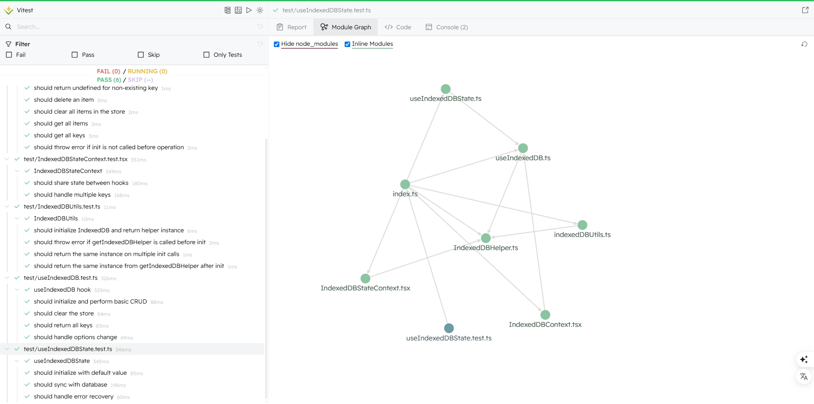

# 🚀 react-idb-toolkit

[English](./README.md) | [简体中文](./README.CN.md)

> ⚛️ 一个优雅且易于使用的 React 工具包，用于通过 IndexedDB 管理本地结构化数据，基于 [idb](https://github.com/jakearchibald/idb) 构建。
> 一个简单、轻量、易用的 React Hook，用于在浏览器中通过 IndexedDB 存储结构化数据。支持多 store 初始化，支持常见的 `get/set/delete/clear` 操作，并有良好的 TypeScript 类型支持与测试用例。


<!--  -->

[访问示例](https://aiyoudiao.github.io/react-idb-toolkit/demo-dist/index.html)
|
[访问 Storybook 示例](https://aiyoudiao.github.io/react-idb-toolkit/storybook-static/index.html)

<p align="center">
    
</p>

---

## 📦 安装

```bash
npm install react-idb-toolkit
# 或
yarn add react-idb-toolkit
```

---

## ✨ 特性

* ✅ 使用 [`idb`](https://www.npmjs.com/package/idb) 封装 IndexedDB，API 简洁直观
* 🔁 支持自动创建多个 object store
* 🧪 内置单元测试（使用 Vitest）
* 📖 提供交互式 Storybook 示例
* 🧠 基于 React Hooks，支持类型推导与泛型
* 📦 除 `idb` 外无其他依赖

---

## 🛠️ 超级简单的 Hooks 使用示例

[预览示例](https://aiyoudiao.github.io/react-idb-toolkit/demo-dist/index.html#/UseIndexedDBState) | [查看代码](https://github1s.com/aiyoudiao/react-idb-toolkit/blob/HEAD/demo/features/UseIndexedDBState.tsx)

```tsx
import { useIndexedDBState } from 'react-idb-toolkit';

export const CounterExample = () => {
  const [count, setCount, { loading }] = useIndexedDBState<number>({
    storeName: "demoStore",
    key: "counter",
    defaultValue: 0,
  });

  return (
    <div className="p-6 text-center space-y-4">
      <h2 className="text-xl font-semibold">Persistent Counter</h2>
      <p className="text-4xl font-bold">{loading ? "..." : count}</p>
      <div className="flex gap-2 justify-center">
        <button onClick={() => setCount((c) => c + 1)}>Increment</button>
        <button variant="outline" onClick={() => setCount(0)}>
          Reset
        </button>
      </div>
    </div>
  )
};
```

### ⚙️ 超级简单的 Hook 参数

```ts
interface UseIndexedDBStateOptions<T> {
  storeName: string;
  key: IDBValidKey;
  defaultValue?: T | (() => T);
  onError?: (error: Error) => void;
}
```

### 📦 超级简单的 Hook 返回值

```ts
[
  value: T;
  setValue: React.Dispatch<React.SetStateAction<T>>;
  {
    loading: boolean;
    sync: () => Promise<...>;
  }
]
```

## 🛠️ 超级简单的 Context 使用示例

[预览示例](https://aiyoudiao.github.io/react-idb-toolkit/demo-dist/index.html#/IndexedDBStateContext) | [查看代码](https://github1s.com/aiyoudiao/react-idb-toolkit/blob/HEAD/demo/features/IndexedDBStateContext.tsx)

```tsx
import {
  IndexedDBStateProvider,
  useIndexedDBStateContext,
} from 'react-idb-toolkit';


const DemoComponent = () => {
  const [value, setValue] = useIndexedDBStateContext<string>("demoKey", "default");

  return (
    <div className="p-4 space-y-4">
      <input value={value} onChange={(e) => setValue(e.target.value)} />
      <p>Current value: {value}</p>
    </div>
  );
};

export const SingleContextUsage = () => (
  <IndexedDBStateProvider storeName="context-store">
    <div className="flex items-center justify-center h-screen bg-gray-100">
      <div className="p-6 space-y-6 max-w-md w-full">
        <h2 className="text-xl font-semibold">Context Demo</h2>
        <DemoComponent />
      </div>
    </div>
  </IndexedDBStateProvider>
);

```

### ⚙️ 超级简单的 Provider 参数

```ts
interface IndexedDBStateProviderProps {
  storeName: string;
  children: React.ReactNode;
}

// context params
{
  key: IDBValidKey,
  defaultValue?: T
}

```

### 📦 超级简单的 Context 返回值

```ts
interface UseIndexedDBStateContextReturn<T> {
  value: T;
  updateValue: React.Dispatch<React.SetStateAction<T>>;
  loading: boolean;
}
```

## 🛠️ Hooks 使用示例

[预览示例](https://aiyoudiao.github.io/react-idb-toolkit/demo-dist/index.html#/UseIndexedDB) | [查看代码](https://github1s.com/aiyoudiao/react-idb-toolkit/blob/HEAD/demo/features/UseIndexedDB.tsx)

```tsx
import { useIndexedDB } from 'react-idb-toolkit';

const { loading, setItem, getItem, deleteItem, clear, getAll, keys } = useIndexedDB({
  dbName: 'myDatabase',
  storeNames: ['myStore'],
});

useEffect(() => {
  if (!loading) {
    setItem('myStore', 'userName', 'demo');
  }
}, [loading]);
```

### ⚙️ Hook 参数

```ts
interface UseIndexedDBOptions {
  dbName: string;       // 数据库名称
  version?: number;     // 数据库版本，默认为 1
  storeNames: string[]; // 要创建的 object store 名称数组
}
```

### 📦 Hook 返回值

```ts
interface UseIndexedDBReturn {
  loading: boolean; // 是否仍在初始化过程中
  getItem<T>(store, key): Promise<T | undefined>;
  setItem<T>(store, key, value): Promise<void>;
  deleteItem(store, key): Promise<void>;
  clear(store): Promise<void>;
  getAll<T>(store): Promise<T[]>;
  keys(store): Promise<IDBValidKey[]>;
}
```

## 🛠️ Context 使用示例

[预览示例](https://aiyoudiao.github.io/react-idb-toolkit/demo-dist/index.html#/IndexedDBContext) | [查看代码](https://github1s.com/aiyoudiao/react-idb-toolkit/blob/HEAD/demo/features/IndexedDBContext.tsx)

```tsx
import { IndexedDBProvider } from 'react-idb-toolkit';

<IndexedDBProvider
  options={{
    dbName: "storybook-db",
    storeNames: ["demoStore"],
  }}
>
  <PlaygroundContent />
</IndexedDBProvider>
```

```tsx
import { useIndexedDBContext } from 'react-idb-toolkit';

const { loading, setItem, getItem, deleteItem, getAll, keys, clear } =
  useIndexedDBContext();

useEffect(() => {
  if (!loading) {
    setItem('demoStore', 'userName', 'demo');
  }
}, [loading]);
```

### ⚙️ Provider 参数

```ts
interface IndexedDBOptions {
  dbName: string;
  version?: number;
  storeNames: string[];
}

interface IndexedDBProviderProps {
  children: ReactNode;
  options: IndexedDBOptions;
}
```

### 📦 Context 返回值

```ts
interface UseIndexedDBReturn {
  loading: boolean; // 是否仍在初始化过程中
  getItem<T>(store, key): Promise<T | undefined>;
  setItem<T>(store, key, value): Promise<void>;
  deleteItem(store, key): Promise<void>;
  clear(store): Promise<void>;
  getAll<T>(store): Promise<T[]>;
  keys(store): Promise<IDBValidKey[]>;
}
```

## 🛠️ Utils 使用示例

[预览示例](https://aiyoudiao.github.io/react-idb-toolkit/demo-dist/index.html#/IndexedDBUtils) | [查看代码](https://github1s.com/aiyoudiao/react-idb-toolkit/blob/HEAD/demo/features/IndexedDBUtils.tsx)

```tsx
import { initIndexedDB, getIndexedDBHelper } from "./toolkit";

let db: IndexedDBHelper | null = null;


useEffect(() => {
  initIndexedDB({
    dbName: "storybook-db",
    storeNames: ["demoStore"],
  }).then(() => {
    db = getIndexedDBHelper();
    const { setItem, getItem, deleteItem, clear, getAll, keys } = db;
    setItem("demoStore", "userName", "demo");
  });
}, []);

```

### ⚙️ initIndexedDB 参数

```ts
interface IndexedDBOptions {
  dbName: string;
  version?: number;
  storeNames: string[];
}

```

### 📦 getIndexedDBHelper 返回值

```ts
interface UseIndexedDBReturn {
  loading: boolean; // 是否仍在初始化过程中
  getItem<T>(store, key): Promise<T | undefined>;
  setItem<T>(store, key, value): Promise<void>;
  deleteItem(store, key): Promise<void>;
  clear(store): Promise<void>;
  getAll<T>(store): Promise<T[]>;
  keys(store): Promise<IDBValidKey[]>;
}
```

---

## 🧪 测试

本项目使用 [Vitest](https://vitest.dev) 进行单元测试，并借助 `fake-indexeddb` 模拟 IndexedDB 环境。

运行测试：

```bash
npm test
```

测试内容包括：

* 数据的存储、读取、删除与清空
* 获取所有 key 和所有 value
* 未初始化数据库时的异常处理

---

## 📖 Storybook Playground

运行以下命令启动交互式 Playground：

```bash
npm run storybook
```

<p align="center">
  
</p>

你可以在 Playground 中：

* 手动输入 key 和 value 存储数据
* 一键查看所有键值对
* 删除或清空数据
* 实时查看存储状态与提示

适合调试和教学演示使用。

---

## 🔧 本地开发

```bash
git clone https://github.com/aiyoudiao/react-idb-toolkit.git
cd react-idb-toolkit
npm install

# 运行测试
npm run test:ui

# 运行示例
npm run dev:demo
```

<p align="center">
    
    
</p>

---

## 📄 许可证

MIT License © [哎哟迪奥](https://github.com/aiyoudiao)

---

## 💬 鸣谢

* [idb](https://github.com/jakearchibald/idb)：底层 IndexedDB 封装库
* [fake-indexeddb](https://github.com/dumbmatter/fakeIndexedDB)：Node 环境下的 IndexedDB 模拟器
* [Vitest](https://vitest.dev/)：现代化的测试框架
* [Storybook](https://storybook.js.org/)：用于构建交互式组件示例的工具

---

由 [idb](https://github.com/jakearchibald/idb) 和 [React](https://reactjs.org/) ❤️ 驱动开发
