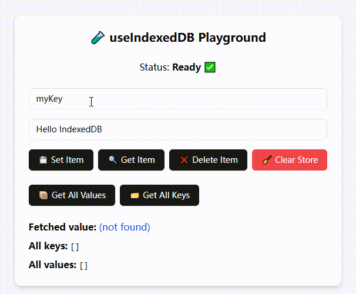

# 🚀 react-idb-toolkit

[简体中文](./README.CN.md) | [English](./README.md)

> ⚛️ Elegant and easy-to-use React toolkit for managing local data with IndexedDB, powered by [idb](https://github.com/jakearchibald/idb).
> A lightweight, simple React hook for storing structured data in the browser via IndexedDB. Supports multiple store initialization, common CRUD operations (`get/set/delete/clear`), with full TypeScript support and test cases.


<!--  -->

[Visit Example](https://aiyoudiao.github.io/react-idb-toolkit/demo-dist/index.html) |
[Visit Storybook Example](https://aiyoudiao.github.io/react-idb-toolkit/storybook-static/index.html)

<p align="center">
    
</p>

---

## 📦 Installation

```bash
npm install react-idb-toolkit
# or
yarn add react-idb-toolkit
```

---

## ✨ Features

* ✅ Simple API powered by [`idb`](https://www.npmjs.com/package/idb)
* 🔁 Automatically creates multiple object stores
* 🧪 Built-in unit tests with Vitest
* 📖 Interactive Storybook Playground
* 🧠 Fully based on React Hooks with type inference and generics
* 📦 Zero external dependencies (except for `idb`)

---

## 🛠️ Supper Simple Hook Usage

[View Demo](https://aiyoudiao.github.io/react-idb-toolkit/demo-dist/index.html#/UseIndexedDBState) | [View Code](https://github1s.com/aiyoudiao/react-idb-toolkit/blob/HEAD/demo/features/UseIndexedDBState.tsx)

```tsx
import { useIndexedDBState } from 'react-idb-toolkit';

export const CounterExample = () => {
  const [count, setCount, { loading }] = useIndexedDBState<number>({
    storeName: "demoStore",
    key: "counter",
    defaultValue: 0,
  });

  return (
    <div className="p-6 text-center space-y-4">
      <h2 className="text-xl font-semibold">Persistent Counter</h2>
      <p className="text-4xl font-bold">{loading ? "..." : count}</p>
      <div className="flex gap-2 justify-center">
        <button onClick={() => setCount((c) => c + 1)}>Increment</button>
        <button variant="outline" onClick={() => setCount(0)}>
          Reset
        </button>
      </div>
    </div>
  )
};
```

### ⚙️ Supper Simple Hook Options

```ts
interface UseIndexedDBStateOptions<T> {
  storeName: string;
  key: IDBValidKey;
  defaultValue?: T | (() => T);
  onError?: (error: Error) => void;
}
```

### 📦 Supper Simple Hook Return Values

```ts
[
  value: T;
  setValue: React.Dispatch<React.SetStateAction<T>>;
  {
    loading: boolean;
    sync: () => Promise<...>;
  }
]
```

## 🛠️ Supper Simple Context Usage

[View Demo](https://aiyoudiao.github.io/react-idb-toolkit/demo-dist/index.html#/IndexedDBStateContext) | [View Code](https://github1s.com/aiyoudiao/react-idb-toolkit/blob/HEAD/demo/features/IndexedDBStateContext.tsx)

```tsx
import {
  IndexedDBStateProvider,
  useIndexedDBStateContext,
} from 'react-idb-toolkit';


const DemoComponent = () => {
  const [value, setValue] = useIndexedDBStateContext<string>("demoKey", "default");

  return (
    <div className="p-4 space-y-4">
      <input value={value} onChange={(e) => setValue(e.target.value)} />
      <p>Current value: {value}</p>
    </div>
  );
};

export const SingleContextUsage = () => (
  <IndexedDBStateProvider storeName="context-store">
    <div className="flex items-center justify-center h-screen bg-gray-100">
      <div className="p-6 space-y-6 max-w-md w-full">
        <h2 className="text-xl font-semibold">Context Demo</h2>
        <DemoComponent />
      </div>
    </div>
  </IndexedDBStateProvider>
);

```

### ⚙️ Supper Simple Provider Options

```ts
interface IndexedDBStateProviderProps {
  storeName: string;
  children: React.ReactNode;
}

// context params
{
  key: IDBValidKey,
  defaultValue?: T
}

```

### 📦 Supper Simple Context Return Values

```ts
interface UseIndexedDBStateContextReturn<T> {
  value: T;
  updateValue: React.Dispatch<React.SetStateAction<T>>;
  loading: boolean;
}
```

## 🛠️ Hook Usage

[View Demo](https://aiyoudiao.github.io/react-idb-toolkit/demo-dist/index.html#/UseIndexedDB) | [View Code](https://github1s.com/aiyoudiao/react-idb-toolkit/blob/HEAD/demo/features/UseIndexedDB.tsx)

```tsx
import { useIndexedDB } from 'react-idb-toolkit';

const { loading, setItem, getItem, deleteItem, clear, getAll, keys } = useIndexedDB({
  dbName: 'myDatabase',
  storeNames: ['myStore'],
});

useEffect(() => {
  if (!loading) {
    setItem('myStore', 'userName', 'demo');
  }
}, [loading]);
```

### ⚙️ Hook Options

```ts
interface UseIndexedDBOptions {
  dbName: string;       // Database name
  version?: number;     // Database version, default is 1
  storeNames: string[]; // List of object store names
}
```

### 📦 Hook Return Values

```ts
interface UseIndexedDBReturn {
  loading: boolean;
  getItem: <T>(storeName: string, key: IDBValidKey) => Promise<T | undefined>;
  setItem: <T>(storeName: string, key: IDBValidKey, value: T) => Promise<void>;
  deleteItem: (storeName: string, key: IDBValidKey) => Promise<void>;
  clear: (storeName: string) => Promise<void>;
  getAll: <T>(storeName: string) => Promise<T[] | undefined>;
  keys: (storeName: string) => Promise<IDBValidKey[] | undefined>;
}
```

## 🛠️ Context Usage

[View Demo](https://aiyoudiao.github.io/react-idb-toolkit/demo-dist/index.html#/IndexedDBContext) | [View Code](https://github1s.com/aiyoudiao/react-idb-toolkit/blob/HEAD/demo/features/IndexedDBContext.tsx)

```tsx
import { IndexedDBProvider } from 'react-idb-toolkit';

<IndexedDBProvider
  options={{
    dbName: "storybook-db",
    storeNames: ["demoStore"],
  }}
>
  <PlaygroundContent />
</IndexedDBProvider>
```

```tsx
import { useIndexedDBContext } from 'react-idb-toolkit';

const { loading, setItem, getItem, deleteItem, getAll, keys, clear } =
  useIndexedDBContext();

useEffect(() => {
  if (!loading) {
    setItem('demoStore', 'userName', 'demo');
  }
}, [loading]);
```

### ⚙️ Provider Options

```ts
interface IndexedDBOptions {
  dbName: string;       // Database name
  version?: number;     // Database version, default is 1
  storeNames: string[]; // List of object store names
}

interface IndexedDBProviderProps {
  children: ReactNode;
  options: IndexedDBOptions;
}
```

### 📦 Context Return Values

```ts
interface UseIndexedDBReturn {
  loading: boolean;
  getItem: <T>(storeName: string, key: IDBValidKey) => Promise<T | undefined>;
  setItem: <T>(storeName: string, key: IDBValidKey, value: T) => Promise<void>;
  deleteItem: (storeName: string, key: IDBValidKey) => Promise<void>;
  clear: (storeName: string) => Promise<void>;
  getAll: <T>(storeName: string) => Promise<T[] | undefined>;
  keys: (storeName: string) => Promise<IDBValidKey[] | undefined>;
}
```

## 🛠️ Utils Usage

[View Demo](https://aiyoudiao.github.io/react-idb-toolkit/demo-dist/index.html#/IndexedDBUtils) | [View Code](https://github1s.com/aiyoudiao/react-idb-toolkit/blob/HEAD/demo/features/IndexedDBUtils.tsx)

```tsx
import { initIndexedDB, getIndexedDBHelper } from "./toolkit";

let db: IndexedDBHelper | null = null;


useEffect(() => {
  initIndexedDB({
    dbName: "storybook-db",
    storeNames: ["demoStore"],
  }).then(() => {
    db = getIndexedDBHelper();
    const { setItem, getItem, deleteItem, clear, getAll, keys } = db;
    setItem("demoStore", "userName", "demo");
  });
}, []);

```

### ⚙️ initIndexedDB Options

```ts
interface IndexedDBOptions {
  dbName: string;       // Database name
  version?: number;     // Database version, default is 1
  storeNames: string[]; // List of object store names
}

```

### 📦 getIndexedDBHelper Return Values

```ts
interface UseIndexedDBReturn {
  loading: boolean; //  Indicates if DB is still initializing
  getItem<T>(store, key): Promise<T | undefined>;
  setItem<T>(store, key, value): Promise<void>;
  deleteItem(store, key): Promise<void>;
  clear(store): Promise<void>;
  getAll<T>(store): Promise<T[]>;
  keys(store): Promise<IDBValidKey[]>;
}
```

---

## 🧪 Testing

Tests are written using [Vitest](https://vitest.dev), with `fake-indexeddb` to simulate browser environment:

```bash
npm test
```

Covered test cases include:

* Data insertion, retrieval, deletion, and clearing
* Fetching all keys and values
* Error handling when DB is not initialized

---

## 📖 Storybook Playground

Start an interactive Storybook playground with:

```bash
npm run storybook
```

<p align="center">
    
</p>

You can:

* Add key/value data manually
* View all keys and values
* Delete or clear data
* Observe dynamic hints and state updates

Perfect for debugging and demos.

---

## 🔧 Local Development

```bash
git clone https://github.com/aiyoudiao/react-idb-toolkit.git
cd react-idb-toolkit
npm install

# Run tests
npm run test:ui

# Start Demo
npm run dev:demo
```

<p align="center">
    
    
</p>

---

## 📄 License

MIT License © [aiyoudiao](https://github.com/aiyoudiao)

---

## 💬 Acknowledgements

* [idb](https://github.com/jakearchibald/idb): A modern IndexedDB wrapper
* [fake-indexeddb](https://github.com/dumbmatter/fakeIndexedDB): Mock IndexedDB implementation for Node.js
* [Vitest](https://vitest.dev/): A fast and modern unit testing framework
* [Storybook](https://storybook.js.org/): Tool for building UI component demos interactively

---

Made with ❤️ using [idb](https://github.com/jakearchibald/idb) and [React](https://reactjs.org/)
