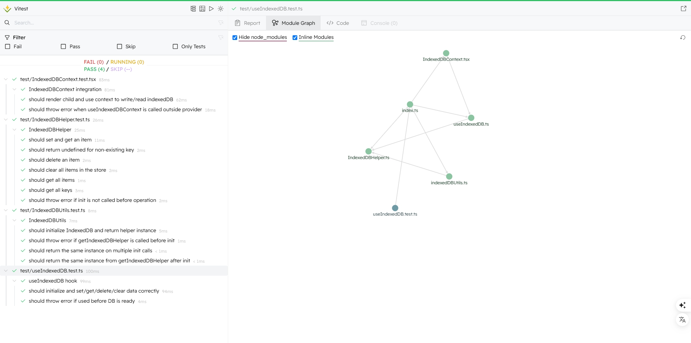

# 🚀 react-idb-toolkit

[简体中文](./README.CN.md) | [English](./README.md)

> ⚛️ Elegant and easy-to-use React toolkit for managing local data with IndexedDB, powered by [idb](https://github.com/jakearchibald/idb).  
> A lightweight, simple React hook for storing structured data in the browser via IndexedDB. Supports multiple store initialization, common CRUD operations (`get/set/delete/clear`), with full TypeScript support and test cases.


[Visit Example](https://aiyoudiao.github.io/react-idb-toolkit/index.html)

<p align="center">
    
    
</p>

---

## 📦 Installation

```bash
npm install react-idb-toolkit
# or
yarn add react-idb-toolkit
```

---

## ✨ Features

* ✅ Simple API powered by [`idb`](https://www.npmjs.com/package/idb)
* 🔁 Automatically creates multiple object stores
* 🧪 Built-in unit tests with Vitest
* 📖 Interactive Storybook Playground
* 🧠 Fully based on React Hooks with type inference and generics
* 📦 Zero external dependencies (except for `idb`)

---

## 🛠️ Usage

```tsx
import { useIndexedDB } from 'react-idb-toolkit';

const { loading, setItem, getItem, deleteItem, clear, getAll, keys } = useIndexedDB({
  dbName: 'myDatabase',
  storeNames: ['myStore'],
});

useEffect(() => {
  if (!loading) {
    setItem('myStore', 'userName', 'demo');
  }
}, [loading]);
```

### ⚙️ Hook Options

```ts
interface UseIndexedDBOptions {
  dbName: string;       // Database name
  version?: number;     // Database version, default is 1
  storeNames: string[]; // List of object store names
}
```

### 📦 Hook Return Values

```ts
interface UseIndexedDBReturn {
  loading: boolean; // Indicates if DB is still initializing
  getItem<T>(store, key): Promise<T | undefined>;
  setItem<T>(store, key, value): Promise<void>;
  deleteItem(store, key): Promise<void>;
  clear(store): Promise<void>;
  getAll<T>(store): Promise<T[]>;
  keys(store): Promise<IDBValidKey[]>;
}
```

---

## 🧪 Testing

Tests are written using [Vitest](https://vitest.dev), with `fake-indexeddb` to simulate browser environment:

```bash
npm test
```

Covered test cases include:

* Data insertion, retrieval, deletion, and clearing
* Fetching all keys and values
* Error handling when DB is not initialized

---

## 📖 Storybook Playground

Start an interactive Storybook playground with:

```bash
npm run storybook
```

You can:

* Add key/value data manually
* View all keys and values
* Delete or clear data
* Observe dynamic hints and state updates

Perfect for debugging and demos.

---

## 🔧 Local Development

```bash
git clone https://github.com/aiyoudiao/react-idb-toolkit.git
cd react-idb-toolkit
npm install

# Run tests
npm test

# Start Storybook
npm run storybook
```

<p align="center">
    
    
</p>


---

## 📄 License

MIT License © [aiyoudiao](https://github.com/aiyoudiao)

---

## 💬 Acknowledgements

* [idb](https://github.com/jakearchibald/idb): A modern IndexedDB wrapper
* [fake-indexeddb](https://github.com/dumbmatter/fakeIndexedDB): Mock IndexedDB implementation for Node.js
* [Vitest](https://vitest.dev/): A fast and modern unit testing framework
* [Storybook](https://storybook.js.org/): Tool for building UI component demos interactively

---

Made with ❤️ using [idb](https://github.com/jakearchibald/idb) and [React](https://reactjs.org/)
